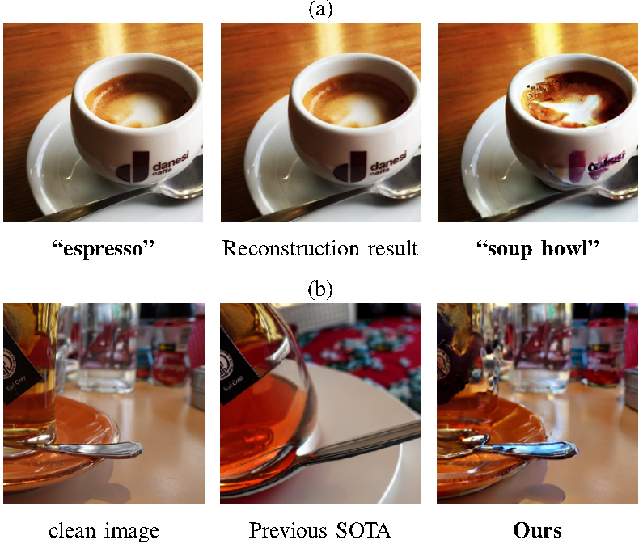








I am a third-year undergraduate student at [the School of Software Engineering](https://sse.sysu.edu.cn/), Sun Yat-sen University. I am interning at [Inpluslab](https://inpluslab.com/) TAI, Sun Yat-sen University, focusing on **Adversarial Attack for Generative Models**, advised by [Weibin Wu](https://sse.sysu.edu.cn/teacher/249). At the same time, I am also interning at [Maple Lab](http://maple-lab.net), Westlake University, focusing on **video generation models**, advised by [Guo-Jun Qi](https://scholar.google.com/citations?user=Nut-uvoAAAAJ&hl=en) (IEEE Fellow). I have interned at [AIR](https://air.tsinghua.edu.cn/), Tsinghua University, focusing on **Image and video editing based on Diffusion**, advised by [Yan Wang](https://yanwang202199.github.io/).

My research interest includes **Diffusion models, Generative AI, Vison-Language models and Adversarial Attack**. 

# 🔥 News
- I am honored with the **Award of Merit** in SUMMER AIR 2024, Presented by Institute for AI Industry Research, Tsinghua University!    -*2024.9.25*
- The work on *SCA: Highly Efficient Semantic Consistent Unrestricted Adversarial Attack* has been preliminarily completed and is expected to be submitted to **IEEE TNNLS**!    -*2024.9.24*

# 📝 Publications 
- **潘子豪**.[一种面向商圈店铺管理规划的机器学习建模分析技术](https://kns.cnki.net/kcms2/article/abstract?v=VIrt19joK6iVe6UAFg_kpR5W3z4P6NHQk-81IDDQykWq34eeDdjXZEwuHanQNyn_3vWdNU6H3srZ9uZzV_HQHeQpH5QCv-KfKEEEe6Z8aAHLXLxcARL-BeOGdhpfdFEY-YajZ3HxakYR33V0nsE0AJn81EqyjvgZf1Sg_xyfHq8=&uniplatform=NZKPT)[J].中国新技术新产品,2024(3):132-136

# 🎖 Honors and Awards
- **CVPR 2024 Workshop** - [Image Matching Challenge 2024](https://www.kaggle.com/competitions/image-matching-challenge-2024/overview) - Hexathlon（Kaggle） **Silver medal**🥈(20/930)
- **Award of Merit** in SUMMER AIR 2024, Presented by Institute for AI Industry Research, Tsinghua University
- 2023年“高教社杯”全国大学生数学建模竞赛“深圳杯”数学建模挑战赛 广东赛区三等奖
- 2023年广东省大学生数学建模竞赛暨全国大学生数学建模竞赛广东省分赛 三等奖
- 2023年第九届全国大学生统计建模大赛广东赛区本科生组三等奖
- 2023年APMCM亚太地区大学生数学建模竞赛 Third Prize
- 2023年第六届“高斯杯”全国大学生数学建模挑战赛 一等奖
- 计算机软件著作《一种用于人脸识别的图像处理软件V1.0》二作（证书号：软著登字第11658428号）
- 工业与信息化人才专业知识测评证书 数学建模科目（证书编号：GXRCCP018202312179）

# 📖 Educations
- *2019.06 - now*, Undergraduate, School of Software Engineering, Sun Yat-sen University. 

# 📃 Projects
- **SCA: Highly Efficient Semantic Consistent Unrestricted Adversarial Attack**: We propose a novel attack framework called Semantic Consistent Unrestricted Adversarial Attack (SCA) via Semantic Fixation Inversion and Semantically Guided Perturbation. The core idea of SCA is to enhance semantic control throughout the entire generation process of unrestricted adversarial examples. We initially utilize an effective inversion method and a powerful MLLM to extract rich semantic priors from a clean image. Subsequently, we optimize the adversarial objective within the latent space under the guidance of these priors. Experiments demonstrate that the adversarial examples exhibit a high degree of semantic consistency compared to existing methods. Furthermore, our method is highly efficient. Consequently, we introduce Semantic Consistent Adversarial Examples (SCAE). Our work can shed light on further understanding the vulnerabilities of DNNs as well as novel defense approaches.

  
 

	

  
  2024.9.26: Our work will be submitted to **IEEE TNNLS**, and the paper will be uploaded to arxiv in the near future. Welcome to follow!🎉    
  

- **On Exploring Adversarial Semantic Space of Large Vision-Language Model**: Large Vision-Language models may have defects in their understanding of certain concepts in the real world, which we can call "Adversarial Semantic Space". In response to the problems of existing methods, we want to propose a method that can search for knowledge gaps in large multimodal models in the semantic space of the real world, that is, to find the "Adversarial Semantic Space".   
  2024.9.26: Our work is in progress and we plan to submit it to **CVPR2025**. The paper and all the code will be uploaded after completion, so stay tuned!    
  
- **MapleVideo**(This is a project I did during my internship at the Maple Lab at Westlake University. For details, please refer to the lab's homepage.)    
  2024.9.26: Our work is in progress and we plan to submit it to **CVPR2025**.    

# 💻 Internships
- *2024.07 - now*, [Maple Lab](http://maple-lab.net/), Westlake University, Hangzhou, China
- *2023.08 - now*, [Inplus Lab]() TAI, Sun Yat-sen University, Zhuhai, China
- *2024.06 - 2024.09*, [AIR](https://air.tsinghua.edu.cn/), Tsinghua University, Beijing, China
- *2024.01 - 2024.03*, [AIR](https://air.tsinghua.edu.cn/), Tsinghua University, Beijing, China
